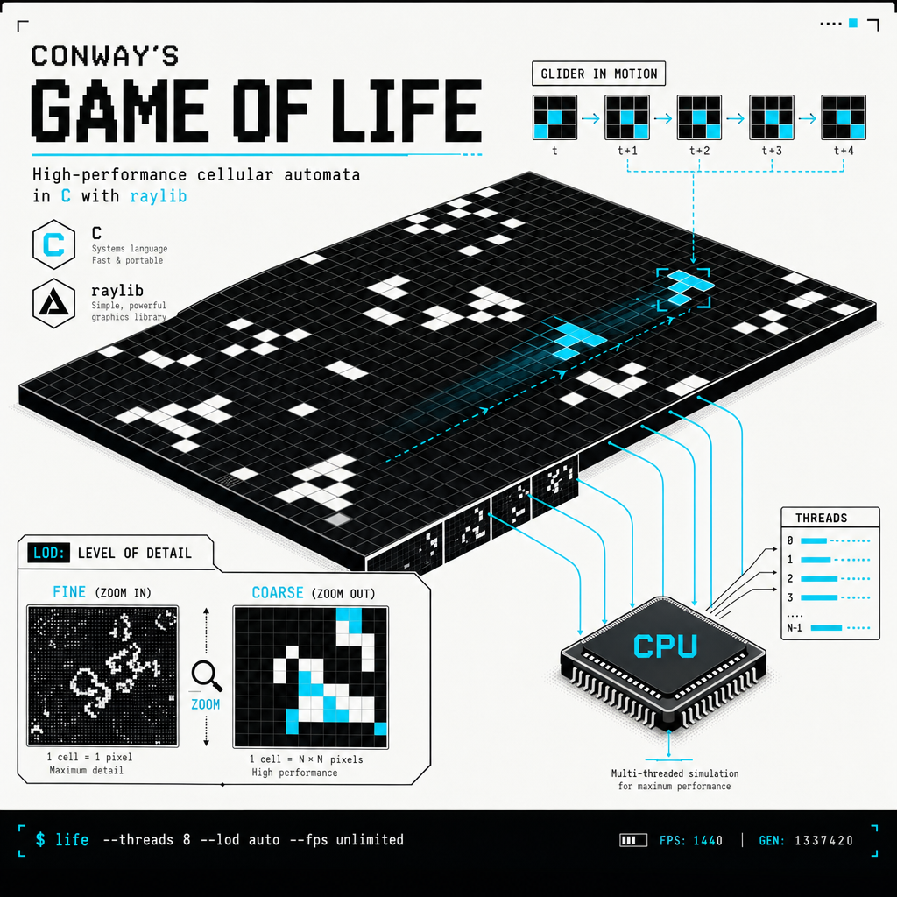

# Conway's Game of Life

A high-performance C implementation of Conway's Game of Life with raylib, featuring threaded simulation decoupled from rendering, level-of-detail scaling for very large grids (default 2048×2048, runs comfortably at 4K+), and interactive pan/zoom controls.

## Build

**macOS:**
```bash
brew install raylib
make
```

**Linux:**
```bash
sudo apt install libraylib-dev
make
```

The Makefile detects raylib via `pkg-config` with a Homebrew fallback on macOS. On Linux, it links against system libraries (libm, libGL, libX11, libpthread, libdl, librt).

## Run

```bash
./gameoflife

# 512×512 grid at 60 TPS
./gameoflife -w 512 -h 512 --tps 60

# 4K grid, uncapped TPS (burn CPU for speed)
./gameoflife -w 4096 -h 4096 --tps 0

# Custom density and RNG seed
./gameoflife --density 0.15 --seed 42

# 1920×1080 window
./gameoflife --win 1920x1080
```

Use `-h` or `--help` to see all options.

## Controls

- **Arrow keys** or **WASD** — pan the view (hold **Shift** to boost pan speed)
- **Mouse scroll** or **[ / ]** (also **- / =**) — zoom in/out
- **Middle-click drag** — drag to pan
- **Space** — pause/resume simulation
- **.** (period) — single step (when paused)
- **R** — randomize grid
- **C** — clear grid
- **G** — toggle grid lines
- **0** / **1** / **2** — TPS presets (uncapped / 60 / 240)
- **Left-click** — paint live cells; **right-click** — erase
- **H** or **F1** — show tutorial overlay

## Architecture

- **Decoupled threads:** Simulation runs on a dedicated worker thread; render runs on the main thread. Double-buffering prevents data races.
- **Level-of-detail (LOD) rendering:** Blocks cells into increasingly coarse tiles (1×1, 2×2, 4×4, etc.) to maintain 60 FPS even on huge grids.
- **raylib integration:** Windowing, input, and texture rendering via raylib; all platform-specific threading uses pthreads.

## License

No license specified — treat as all rights reserved.
